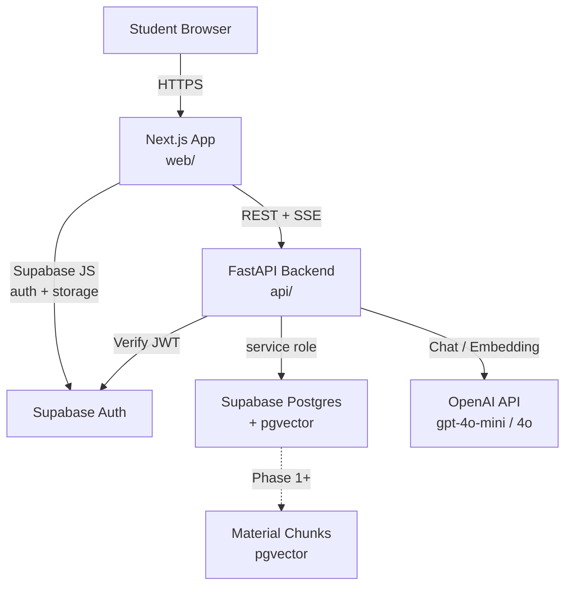

# 学生学习驾驶舱 (AI Study Coach)

> 让每个初高中学生都有一个能记住学习进度的课后 AI 学习助手。

班主任 Agent 帮你做规划,各科老师 Agent 负责讲解,资料库提供可信上下文,学习进度系统沉淀学生画像 — 让每一次提问都能变成下一次更个性化的学习建议。

详细产品设计见 [product_design.md](product_design.md)。

---

## 当前进度

### Phase 0 — 基础工程 ✅

一个完整可运行的全栈 MVP:学生能注册 → 完成 onboarding → 在学习驾驶舱看到自己信息 → 与四位 AI 老师(班主任/数学/英语/语文)进行流式对话,历史持久化保存。

- [x] 环境变量集中在 `.env`,模板见 `.env.example`
- [x] Supabase 数据库 Schema + RLS + 种子数据 ([supabase/migrations/0001_phase0_init.sql](supabase/migrations/0001_phase0_init.sql))
- [x] Next.js 14 + Tailwind + 手写 shadcn 风格组件 + 中文字体/主题
- [x] Supabase Auth 登录/注册 + 邮箱确认引导
- [x] 三步 Onboarding 表单(年级 → 重点科目 → 目标)
- [x] Dashboard 学习驾驶舱:学生头部 / 今日任务(占位) / 各科卡片 / 班主任入口 / 最近对话
- [x] Chat 三栏布局:左 Agent 列表 + 中流式对话 + 右学生画像
- [x] FastAPI 后端 + Supabase JWT 验证 + CORS
- [x] OpenAI 混合模型:`gpt-4o-mini` 日常,`gpt-4o` 关键场景
- [x] 四个 Agent 的 system prompt 落地 ([api/app/agents/prompts/](api/app/agents/prompts/))
- [x] Chat SSE 流式接口 + 历史消息持久化
- [x] 端到端联调脚本 [scripts/dev.sh](scripts/dev.sh)

### 后续 Phase Roadmap

- **Phase 1 — 资料上传 + RAG**:Supabase Storage 文件上传、PDF/Word/TXT 解析、切片、`text-embedding-3-small` 向量化、pgvector top-k 检索,Chat 回答中展示引用资料来源
- **Phase 2 — 学习进度沉淀**:`knowledge_points` 种子树 + 对话后用 LLM 抽取知识点和薄弱点 → 写入 `student_progress`;Dashboard 渲染真实掌握度
- **Phase 3 — 任务系统 + 学习报告**:规则 + LLM 生成今日任务、周学习报告
- **Phase 4 — 管理端 + 安全**:平台公共资料、学生列表/对话日志、内容安全审核

---

## 技术栈

| 层 | 选型 |
| --- | --- |
| 前端 | Next.js 14 (App Router) + TypeScript + Tailwind + 自写 shadcn 组件 + TanStack Query + `@supabase/ssr` |
| 后端 | FastAPI + Pydantic + httpx + OpenAI SDK + `supabase-py` |
| 数据库 | Supabase Postgres (含 Auth / Storage / pgvector) |
| AI | OpenAI:`gpt-4o-mini` 默认 + `gpt-4o` 关键场景 + `text-embedding-3-small` (Phase 1) |
| 部署 (后续) | Vercel (前端) + Railway/Render/自建 (后端) |

---

## 架构图



---

## 仓库结构

```text
student_coach/
  .env                     # 本地敏感配置 (不入 git)
  .env.example             # 模板
  product_design.md        # 产品设计文档
  README.md                # (本文件)
  scripts/dev.sh           # 一键启动前后端
  supabase/
    migrations/0001_phase0_init.sql
    seed.sql               # 种子学科数据
  web/                     # Next.js 前端
    app/
      (auth)/login         (auth)/signup
      onboarding
      dashboard
      chat/[sessionId]
    components/            # StudentHeader / TaskCard / AgentSidebar / ChatWindow ...
    lib/                   # supabase 客户端、api 封装、agents 配置、types
    middleware.ts          # 路由级登录保护
  api/                     # FastAPI 后端
    app/
      main.py
      core/                # config / auth / llm
      routes/              # chat / students / health
      services/            # chat_service (与 agent runtime 粘合)
      agents/              # registry + 四个 prompt 文件 + runtime
      db/                  # supabase_client + repos
      schemas/             # Pydantic 模型
    requirements.txt
```

---

## 本地启动

### 0. 准备 Supabase 项目 (一次性,约 5 分钟)

1. 在 [https://supabase.com](https://supabase.com) 注册并新建项目(建议 Singapore 区,免费 tier 即可)
2. 在 `Project Settings → API` 拿到三个值,填入项目根目录 `.env`:
   - `Project URL` → `SUPABASE_URL` 和 `NEXT_PUBLIC_SUPABASE_URL`
   - `anon public` key → `SUPABASE_ANON_KEY` 和 `NEXT_PUBLIC_SUPABASE_ANON_KEY`
   - `service_role` key → `SUPABASE_SERVICE_ROLE_KEY` (**只给后端用,别泄到前端**)
3. 打开 Supabase Dashboard → `SQL Editor`,新建查询粘贴 [supabase/migrations/0001_phase0_init.sql](supabase/migrations/0001_phase0_init.sql) 内容并执行
4. 再粘贴 [supabase/seed.sql](supabase/seed.sql) 执行一次,导入数学/英语/语文三个学科
5. (可选) `Authentication → Providers → Email` 中,本地开发可以关闭 "Confirm email" 让注册更顺;生产环境务必打开

### 1. 启动

```bash
# 推荐:一键启动前后端 (首次会自动建 venv / 装依赖)
./scripts/dev.sh
```

或分别启动:

```bash
# 后端 (Python 3.11+)
cd api
python3 -m venv .venv
source .venv/bin/activate
pip install -r requirements.txt
uvicorn app.main:app --reload --port 8000
```

```bash
# 前端
cd web
npm install
npm run dev
```

打开 [http://localhost:3000](http://localhost:3000)。

后端文档:[http://localhost:8000/docs](http://localhost:8000/docs)
后端自检:[http://localhost:8000/health/config](http://localhost:8000/health/config) — 会显示 OpenAI / Supabase 是否配置成功。

---

## Phase 0 验收清单

打开 [http://localhost:3000](http://localhost:3000),按顺序完成以下流程,即表示 Phase 0 成功:

1. 进入登录页,点击「注册一个新账号」
2. 填写昵称、邮箱、密码完成注册(若 Supabase 开了邮箱确认,先到邮箱点链接)
3. 自动跳转到三步 onboarding:年级 → 重点科目 → 学习目标
4. 完成后进入 Dashboard,看到自己的昵称、年级、目标、班主任入口、各科卡片、最近对话(空)
5. 点 Dashboard 上「找班主任规划一下」或任意一张科目卡片
6. 进入 Chat 页,看到 AI 老师的欢迎语和三条引导式提问
7. 输入任意问题(例如:"我数学一次函数总弄不懂,你能讲讲吗?"),应该看到 AI 流式逐字回复,符合该角色风格
8. 刷新页面,对话历史仍在;左侧「历史对话」列表里能看到这次会话
9. 点击 Dashboard 上方科目卡片,会切换/创建对应学科的对话

---

## 产品设计原则 (贯穿全程)

- **语调**:中文优先,鼓励而不焦虑,措辞像学长姐或学习教练,不命令式
- **视觉**:现代温暖。主色 `indigo-600` 信任 + 辅色 `amber-500` 激励;圆角 `rounded-2xl`;卡片留白充足
- **字体**:`Inter + PingFang SC + 微软雅黑` 字体栈,兼顾中英文渲染
- **微交互**:消息流式、卡片 hover 抬升、按钮按下缩放,营造响应感
- **可信感**:Phase 1 起,AI 回答如有引用资料,必须清晰可见来源
- **隐私 & 合规**:面向未成年人,Agent prompt 中显式约束不输出不当内容、不代写作业、不制造焦虑;数据最小化
- **3 步内**:登录 → 首页 → 开始对话 在 3 次点击内完成

---

## 环境变量速查

完整模板见 [.env.example](.env.example)。关键变量:

| Key | 说明 |
| --- | --- |
| `OPENAI_API_KEY` | OpenAI 主 key |
| `OPENAI_CHAT_MODEL_DEFAULT` | 日常对话使用的模型(默认 `gpt-4o-mini`) |
| `OPENAI_CHAT_MODEL_PREMIUM` | 关键场景使用的高质量模型(默认 `gpt-4o`) |
| `OPENAI_EMBEDDING_MODEL` | 向量嵌入模型(Phase 1) |
| `SUPABASE_URL` / `NEXT_PUBLIC_SUPABASE_URL` | Supabase 项目 URL |
| `SUPABASE_ANON_KEY` / `NEXT_PUBLIC_SUPABASE_ANON_KEY` | 客户端 anon key |
| `SUPABASE_SERVICE_ROLE_KEY` | 后端 service role key (绕过 RLS) |
| `NEXT_PUBLIC_API_BASE_URL` | 前端调用后端的地址(本地 `http://localhost:8000`) |
| `BACKEND_CORS_ORIGINS` | 后端允许的前端来源(默认 localhost:3000) |

---

## 常见问题

**Q: Dashboard 报错 "无法加载 Dashboard 数据"?**
A: 通常是 (1) 后端未启动 (2) `.env` 里 Supabase keys 还是占位符 (3) 没跑 migration。访问 `http://localhost:8000/health/config` 看 `supabase_configured` 是否 `true`。

**Q: 注册后跳到 onboarding,但 onboarding 页面卡住?**
A: 同上,大概率是后端不可达或 Supabase 配置缺失,导致 `GET /api/student/profile` 失败。打开浏览器 DevTools → Network 看具体错误。

**Q: Chat 输入后报 401?**
A: Supabase Auth token 失效或 `SUPABASE_URL` 配置错。重新登录通常即可。

**Q: 想直接拿来部署?**
A: Phase 0 是开发版本。生产部署建议:前端走 Vercel,后端 Dockerize 上 Railway/Render/Fly;务必在 Supabase 打开邮箱确认 + RLS;`SUPABASE_SERVICE_ROLE_KEY` 只在后端环境变量配置。
