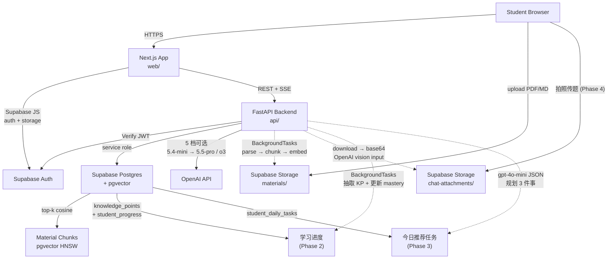

# 学生学习驾驶舱 (AI Study Coach)

> 让每个初高中学生都有一个能记住学习进度的课后 AI 学习助手。

班主任 Agent 帮你做规划,各科老师 Agent 负责讲解,资料库提供可信上下文,学习进度系统沉淀学生画像 — 让每一次提问都能变成下一次更个性化的学习建议。

详细产品设计见 [product_design.md](product_design.md)。

---

## 当前进度

### Phase 0 — 基础工程 ✅

一个完整可运行的全栈 MVP:学生能注册 → 完成 onboarding → 在学习驾驶舱看到自己信息 → 与四位 AI 老师(班主任/数学/英语/语文)进行流式对话,历史持久化保存。

- [x] 环境变量集中在 `.env`,模板见 `.env.example`
- [x] Supabase 数据库 Schema + RLS + 种子数据 ([supabase/migrations/0001_phase0_init.sql](supabase/migrations/0001_phase0_init.sql))
- [x] Next.js 14 + Tailwind + 手写 shadcn 风格组件 + 中文字体/主题
- [x] Supabase Auth 登录/注册 + 邮箱确认引导
- [x] 三步 Onboarding 表单(年级 → 重点科目 → 目标)
- [x] Dashboard 学习驾驶舱:学生头部 / 今日任务(占位) / 各科卡片 / 班主任入口 / 最近对话
- [x] Chat 三栏布局:左 Agent 列表 + 中流式对话 + 右学生画像
- [x] FastAPI 后端 + Supabase JWT 验证 + CORS
- [x] OpenAI 混合模型:`gpt-4o-mini` 日常,`gpt-4o` 关键场景
- [x] 四个 Agent 的 system prompt 落地 ([api/app/agents/prompts/](api/app/agents/prompts/))
- [x] Chat SSE 流式接口 + 历史消息持久化
- [x] 端到端联调脚本 [scripts/dev.sh](scripts/dev.sh)

### Phase 1 — 资料上传 + RAG ✅

让学生把自己的笔记 / 讲义 / 错题本上传进来,AI 老师基于这些资料回答,而不是泛泛而谈。

- [x] Supabase Storage `materials` 桶 + RLS 隔离 (学生只能读自己目录)
- [x] `learning_materials` + `material_chunks` 表 + HNSW 向量索引 ([0002_phase1_materials.sql](supabase/migrations/0002_phase1_materials.sql))
- [x] 上传 → 后台异步解析 (PDF via `pypdf` / TXT / Markdown) → token-aware 切片 (tiktoken, 目标 400 + 重叠 50) → `text-embedding-3-small` 向量化
- [x] pgvector `match_material_chunks` RPC,owner / material_ids 双重过滤后 top-k cosine 检索
- [x] Chat 消息可带 `material_ids`,Agent runtime 把召回片段注入 system prompt 并要求用 `[1] [2]` 引用
- [x] SSE 新增 `citations` 事件,前端实时展示;assistant 消息 `metadata.citations` 持久化
- [x] 前端 `/materials` 页:拖拽上传 + 状态徽章 (排队/切片中/可用/失败) + 删除 + 自动轮询
- [x] Chat 输入框上方 `MaterialPicker`,勾选若干份资料就能让老师基于它们回答
- [x] **Markdown 对话渲染**:`react-markdown` + GFM (表格 / 删除线 / 任务列表) + KaTeX 数学公式 (`$x^2+1=0$`, `$$\frac{a}{b}$$`),数学老师终于能写公式了

### Phase 1 polish — 视觉与 AI 可见性 ✅

- [x] 重做色彩系统 "Studied Indigo":单一品牌色 indigo-600 + slate 灰阶,告别七彩渐变
- [x] 所有 Agent 头像 monochrome,靠 emoji + 名字区分,UI 更高级、不再"五颜六色"
- [x] 新建 `<ModelBadge>` 组件;在 Dashboard / Chat 顶栏 / 消息脚注 / 资料页都显式标注 `gpt-4o-mini` / `text-embedding-3-small` 等
- [x] SSE `ready` / `done` 事件携带 `model` 字段;assistant 消息 metadata 持久化 `model`

### Phase 1.5 — 平台公共资料 ✅

让所有学生开箱就能用到一份「AI 自动生成的初中讲义库」,同时各自的私有资料完全隔离。

- [x] DB schema 早已支持:`owner_type='platform' | 'student'`,RLS 让所有用户可读 platform,只能改/删自己的
- [x] `match_material_chunks` RPC 在 SQL 层就处理了 platform 资料的检索可见性
- [x] **课标骨架** ([seed-data/curriculum/](seed-data/curriculum/)):三科各 ~17 个核心知识点,基于 2022 义务教育课程标准
- [x] `scripts/generate_knowledge_notes.py`:用 `gpt-4o` 基于课标骨架批量生成 markdown 讲义,产出到 `seed-data/platform/<subject>/`
- [x] `scripts/seed_platform_materials.py`:用 service_role 把讲义上传到 Storage `platform/<uuid>.md` + 入库为 `owner_type='platform'` + 复用 `material_processor` 切片向量化
- [x] **51 份 AI 讲义已入库**:数学 17 / 英语 17 / 语文 17,共 ~220 chunks
- [x] 前端 `/materials` 重做:Tab 切换「我的资料」/「公共资料」;公共资料按学科筛选,带「公共 / AI 讲义」徽章,禁止删除
- [x] `MaterialPicker` 分 section 显示两类资料;选中后后端 RAG 不需要区分
- [x] `scripts/phase15_smoke.py`:12 项断言,验证新用户能看到 platform 资料 + 基于 platform 做 RAG + 不能删 platform

### Phase 2.5 — 学习流引导 (Follow-up Suggestions) ✅

让学生不用每次自己想下一步问什么 — 每轮回答之后,AI 立刻给 2-3 条「接下来可以问什么」的胶囊建议,一键续问。

- [x] **抽取服务** ([suggester.py](api/app/services/suggester.py)):`gpt-4o-mini` + JSON mode,基于最近一轮对话 + 学生薄弱点 + 候选 KP 列表生成 2-3 条建议
- [x] **四种类型**:`deep_dive` (继续深入)、`explore` (拓展课题)、`practice` (做道题)、`review` (回顾薄弱);至少 1 条 deep_dive 兜底
- [x] **SSE 集成**:`follow_ups` 事件在主回答 streaming 结束后、`done` 之前推送,前端在用户看完回答时建议正好就绪
- [x] **持久化**:写入 `assistant.metadata.follow_ups`,刷新会话依然能看到建议
- [x] **前端**:`ChatWindow` 在最后一条 assistant 消息下方渲染 4 种类型的胶囊按钮(配对应图标),点击即续问;streaming 中显示"AI 正在准备建议…"的微提示
- [x] **学科 + 班主任都支持**:学科老师注入候选 KP 提高准确度;班主任也能给学习节奏类建议
- [x] `scripts/phase25_smoke.py`:9 项断言,验证 SSE follow_ups 在 done 前到达 + metadata 落库 + 至少 1 条 deep_dive

### Phase 2 — 学习进度沉淀 ✅

每次和学科老师聊天后,后台异步抽取这一轮涉及的知识点 + 掌握度,沉淀到 `student_progress`,Dashboard 各科卡片实时反映真实状态。

- [x] DB schema ([0003_phase2_progress.sql](supabase/migrations/0003_phase2_progress.sql)):`knowledge_points` 树 + `student_progress` 表 + 三个 RPC (`summarize_student_progress` / `list_weak_points` / `recent_chapter`) + RLS
- [x] 知识点树 ([seed-data/knowledge-points/](seed-data/knowledge-points/)):三科共 **21 chapters · 51 leaves**;leaf id 与 Phase 1.5 课标对齐 (一个 leaf ↔ 一份 AI 讲义)
- [x] `scripts/seed_knowledge_points.py`:upsert 知识点树到 Supabase (幂等)
- [x] `scripts/apply_migration.py`:psycopg 直连远端,一键应用任意 .sql migration
- [x] **抽取服务** ([progress_extractor.py](api/app/services/progress_extractor.py)):用 `gpt-4o-mini` + JSON mode,把一轮对话映射到 ≤3 个候选知识点 + 状态 (asked / struggled / got_it / reviewed) + mastery_delta
- [x] **触发**:chat 路由用 FastAPI `BackgroundTasks`,SSE 流结束后异步执行抽取,不阻塞用户;`head_teacher` 跳过 (与学科无关)
- [x] **更新逻辑**:`student_progress` upsert,mastery 增量更新 (clamp 0-100) + encounter_count + recent_error_count + last_evaluation jsonb
- [x] **API**:`GET /api/student/progress` 返回各学科 `{avg_mastery, covered_count, weak_count, current_chapter, weak_points[]}`;也拼到 `/api/student/dashboard`
- [x] **前端**:`SubjectProgressCard` 接真实 mastery / 当前章节 / 薄弱点;每张卡底部用 `<Sparkles>` 标注「由 gpt-4o-mini 分析对话生成」
- [x] `scripts/phase2_smoke.py`:12 项断言,验证完整 chain (对话 → BackgroundTask 抽取 → progress 更新 → dashboard 真实数据 → head_teacher 不抽取)

### Phase 3 — 今日推荐任务 ✅

每天打开 App,Dashboard 顶部都是 3 条「点开就能学」的任务,基于学生真实进度由 AI 班主任规划 — 学生不用再自己想"今天该做什么",直接点卡片 → 自动进入对话 → 第一句话已经发给老师。

- [x] DB schema ([0004_phase3_daily_tasks.sql](supabase/migrations/0004_phase3_daily_tasks.sql)):`student_daily_tasks` 表 (student_id × date 唯一) + jsonb tasks + 生成上下文快照 + RLS (只读自己,写仅 service_role)
- [x] **任务规划服务** ([task_planner.py](api/app/services/task_planner.py)):`gpt-4o-mini` + JSON mode,基于学生画像 / 各学科 progress / 薄弱点 / 最近 7 天对话痕迹生成 3 条任务
- [x] **多样性约束**:至少 1 条 `规划` (head_teacher),覆盖 ≥ 2 个学科,薄弱学科优先排第 1;后端校验 + 校正不合格输出
- [x] **任务结构**:title / description / subject_label / agent_type / estimated_minutes / tag (薄弱·复习·新学·规划) / **starter_prompt**(学生第一人称口语)/ knowledge_point_ids
- [x] **缓存策略**:按学生+日期 upsert,同一天多次刷新走缓存(避免重复烧 token);`?refresh=true` 强制重新生成;新用户走兜底任务集
- [x] **API**:`GET /api/student/tasks/today` 独立可用;`/api/student/dashboard` 顺带返回 tasks (单次拉取,首屏一次到底)
- [x] **前端 Dashboard**:`TaskCard` 替换 Phase 0 的占位 — 真实任务、颜色区分 tag、显示 `gpt-4o-mini` 模型水印、"换一组"按钮一键 refresh
- [x] **一键开始任务**:点击任务卡 → `chatApi.createSession(agent_type)` → 跳到 `/chat/<id>?prompt=<starter>` → chat 页检测 query 后**自动发送 starter_prompt**(仅首次,清掉 URL 防重)
- [x] **顶部"对话" tab**:`AppHeader` 加入「对话」入口,点击跳到最近一条 session;没有对话时为该学生即时创建一个 head_teacher 会话再进入
- [x] `scripts/phase3_smoke.py`:**22 项断言**,验证 shape / 幂等 / `refresh=true` 推进 updated_at / dashboard.tasks 一致 / 有 progress 后任务包含多学科 + 至少 1 个 head_teacher + model 字段非空

### Phase 3.5 — 跳转体感 / 资料层级 / 多模型档位 ✅

针对真实使用反馈的三处打磨,把 MVP 从「能用」推到「顺手」:

#### 1. 修复点击老师后跳转慢 / 不打开
- **症状**:点击 Dashboard 上某个老师卡 / 任务卡后,Supabase / 后端网络抖动时整个交互"卡住",学生不知道按了没。
- `lib/api.ts` 的统一 `request()` 加 **20s 超时 + AbortSignal**,任何 REST 请求超时都会抛友好错误("请求超时,请检查网络后重试")。
- Dashboard 维护 `creatingKey` 状态:点击任意卡片后立即 disable + 显示 spinner,**防止重复点击多次建会话**;失败时在卡片上方 inline 错误条(不再用 alert)。
- `HeadTeacherCard` / `SubjectProgressCard` / `TaskCard` 都加 `busy` prop,显示"正在打开…"。
- 顶栏「对话」 tab 同步加 loading + 错误兜底。

#### 2. 资料库层级化 (按学科分组 + 全选 + 搜索)
- `MaterialPicker` 重写:**顶部搜索框** + **按"我上传的 / 数学 / 英语 / 语文"分组可折叠** + 每组**「全选 / 全取消」**按钮;默认只展开"我的",学科组折叠避免 50+ 平铺;搜索时自动展开。
- `/materials` 公共资料 tab 同样按学科分 section + 可折叠 + 搜索;有学科 filter 时只展开 filter 那组。
- 解决了之前"51 份公共讲义一齐铺开很难找"的问题。

#### 3. 多模型档位 (low / medium / high / extra-high / max)
- 后端 `ModelTier` 扩展为 5 档,每档暴露 `model name / capability(1-10) / cost(1-10) / desc` 元数据;`DEFAULT/PREMIUM` 保留为 `MEDIUM/HIGH` 的别名,旧调用代码零迁移。
- 2026 默认映射 (`api/app/core/llm.py::_FALLBACK_MODELS`,`.env` 可覆盖):

  | tier | model | $/1M in/out | 用途 |
  |---|---|---|---|
  | low | `gpt-5.4-mini` | $0.75 / $4.5 | 背单词、简短问答 |
  | medium | `gpt-5.4` | $2.50 / $15 | **推荐默认**,日常对话 |
  | high | `gpt-5.5` | $5 / $30 | 旗舰,复杂讲解 |
  | extra_high | `o3` | $2 / $8 | 推理,长链思考 |
  | max | `gpt-5.5-pro` | $30 / $180 | 顶级,压轴大题 |

- 后台服务降级用 LOW(`progress_extractor` / `suggester` 抽取建议)、`task_planner` 用 MEDIUM 保证规划质量,避免 background 任务跟用户对话默认绑定升级。
- `/health/config` 新增 `model_tiers[]` 和 `default_tier` 字段,前端 `ModelSelector` 直接渲染。
- 前端在 chat 页右上角加 **`ModelSelector` 紧凑下拉**:展示当前 tier · model · 能力/开销 dot meter,选中后 `localStorage` 按 agent type 记忆,下次进同类老师对话自动用上一次选择;SSE 消息体加 `model_tier` 字段。
- 推理类模型(`o*` 系列)自动跳过 `temperature` 参数,避免 API 报错。

### Phase 4 — 图片对话(拍照传题) ✅

让学生看不懂题目时直接拍照,数学/英语/语文老师"看图讲题"。

- **Storage 隔离** ([0005_phase4_chat_images.sql](supabase/migrations/0005_phase4_chat_images.sql)):新建 private bucket `chat-attachments`,RLS 让学生只能读写 `chat-attachments/<own_uid>/`,后端 service_role 拉对象转 base64 inline 喂给 OpenAI vision。
- **后端 `POST /api/chat/attachments`**:学生多文件上传,校验 mime / 5MB / png+jpeg+webp+gif → Storage 落 `<uid>/<uuid>.<ext>` → 返回 `storage_path`(无独立 DB row,图片信息全挂在 `chat_messages.metadata.image_urls`)。
- **`SendMessageRequest.image_urls`**:学生发消息时把多张图的 storage_path 一并带上;后端写库前过滤掉非本 uid 路径,防猜路径越权。
- **多模态历史** ([chat_service.py](api/app/services/chat_service.py)):`_enrich_history_with_images` 把整段历史里所有带 `metadata.image_urls` 的 user msg 都拉对象、转 `data:image/...;base64,...` URL,以一个内存 cache 复用避免重复下载;多轮对话里之前的图仍能被模型"看见"。
- **`agent runtime build_messages`**:对带 `_image_data_urls` 的 user msg 把 content 拼成 OpenAI vision 期望的 `[{text}, {image_url}, ...]` array,5 档模型(`gpt-5.4-mini` → `gpt-5.5-pro`,`o3`)全部走 vision 路径;assistant / 无图 user 仍是纯字符串,反推理模型(`o*`)的 `temperature` 跳过逻辑沿用。
- **前端 `ChatInput`**:
  - 输入框左侧加 ImagePlus 按钮,文件 picker(`accept=image/*` + multiple)
  - **拖拽**到输入框任意区域 / **粘贴**(`Ctrl+V` 截图)都能直接添加图
  - 缩略图 16×16 横排,上传中转圈、失败红边、hover 出 X 按钮可移除
  - 限制 ≤ 3 张 / 单张 ≤ 5MB,触发限制 inline 红条提示 4s 自动消失
  - 文字可留空(默认带"帮我看看这道题"占位),Enter 直接发图;有图未传完时 Send 按钮变 spinner 阻止发送
- **前端 `ChatWindow`**:user 气泡内部上方渲染 24×24 缩略图,点击在新 tab 打开大图;`ChatMessageImages` hook 自动用 Supabase Signed URL(1h 有效)拉显示,刷新页面也能回看
- **`lib/api.ts`**:`chatApi.uploadAttachment(file)` + `chatApi.getAttachmentSignedUrl(path)`;`sendMessageStream` 加 `imageUrls` option
- **`scripts/phase4_smoke.py`**:5 项断言,验证 storage upload → download → base64 转换 → history enrich → multimodal `build_messages` 全链路通畅

> 用法:对话里点 🖼️ 或者直接 Ctrl+V 粘贴一张题目截图,加一句"这道题怎么做?"→ AI 老师就能看图分步骤讲解,RAG 资料引用照样可叠加。

### 后续 Phase Roadmap

- **Phase 5 — 学习报告 + 任务闭环**:聚合最近 7/30 天的学习节奏 + 掌握度变化曲线 + AI 生成总结(发送给家长前置);今日任务加 `pending/in_progress/completed` 状态 + 班主任对话尾问"今天的任务完成了吗"
- **Phase 6 — 作业辅导深化**:题目分步引导 prompt(不直接给答案、先问卡在哪一步) + 错因分类(概念/公式/审题/计算/方法/表达) + 错题本工作流
- **Phase 7 — 管理端 + 家长端**:平台公共资料管理 UI、学生列表/对话日志、家长视角周报、内容安全审核、防沉迷使用时长提醒

---

## 技术栈

| 层 | 选型 |
| --- | --- |
| 前端 | Next.js 14 (App Router) + TypeScript + Tailwind + 自写 shadcn 组件 + TanStack Query + `@supabase/ssr` |
| 后端 | FastAPI + Pydantic + httpx + OpenAI SDK + `supabase-py` |
| 数据库 | Supabase Postgres (含 Auth / Storage / pgvector) |
| AI | OpenAI 5 档可选 (Phase 3.5):**low** `gpt-5.4-mini` / **medium** `gpt-5.4` (默认) / **high** `gpt-5.5` / **extra-high** `o3` / **max** `gpt-5.5-pro`;`text-embedding-3-small` (Phase 1 RAG);后台抽取/建议用 LOW 控本,任务规划用 MEDIUM 保质;学生可在对话里随时切档 |
| 部署 (后续) | Vercel (前端) + Railway/Render/自建 (后端) |

---

## 架构图



---

## 仓库结构

```text
student_coach/
  .env                     # 本地敏感配置 (不入 git)
  .env.example             # 模板
  product_design.md        # 产品设计文档
  README.md                # (本文件)
  scripts/
    dev.sh                 # 一键启动前后端
    smoke_test.py          # 后端 Phase 0 端到端测试 (34 项)
    phase1_smoke.py        # 后端 Phase 1 RAG 端到端测试 (17 项)
    frontend_smoke.py      # 前端中间件 + 路由保护测试 (16 项)
  supabase/
    migrations/
      0001_phase0_init.sql
      0002_phase1_materials.sql
    seed.sql               # 种子学科数据
    seed-data/               # 平台公共资料 + 知识点 (Phase 1.5 + Phase 2)
    curriculum/            # 课标骨架 yaml (人工维护)
    platform/<subject>/    # AI 生成的 markdown 讲义 (gen 出来的)
    knowledge-points/      # 知识点树 yaml (Phase 2)
  scripts/
    dev.sh                          # 一键启动前后端
    smoke_test.py                   # Phase 0 后端冒烟
    phase1_smoke.py                 # Phase 1 (RAG) 后端冒烟
    phase15_smoke.py                # Phase 1.5 (公共资料) 后端冒烟
    phase2_smoke.py                 # Phase 2 (学习进度) 后端冒烟
    phase25_smoke.py                # Phase 2.5 (follow-up 引导) 后端冒烟
    phase3_smoke.py                 # Phase 3 (今日推荐任务) 后端冒烟
    frontend_smoke.py               # 前端路由 + 中间件冒烟
    apply_migration.py              # psycopg 直连应用任意 .sql migration
    generate_knowledge_notes.py     # Phase 1.5: 基于课标生成 AI 讲义
    seed_platform_materials.py      # Phase 1.5: 把讲义入库为 platform 资料
    seed_knowledge_points.py        # Phase 2: 把知识点树入库
  web/                     # Next.js 前端
    app/
      (auth)/login         (auth)/signup
      onboarding
      dashboard
      materials            # 资料库 (Phase 1)
      chat/[sessionId]
    components/            # MarkdownMessage / MaterialUploader / MaterialPicker / ChatWindow ...
    lib/                   # supabase 客户端、api 封装、agents 配置、types
    middleware.ts          # 路由级登录保护
  api/                     # FastAPI 后端
    app/
      main.py
      core/                # config / auth / llm
      routes/              # chat / students / materials / health
      services/            # chat_service / parser / chunker / embedding / retrieval / material_processor / progress_extractor / suggester / task_planner
      agents/              # registry + 四个 prompt 文件 + runtime
      db/                  # supabase_client + repos
      schemas/             # Pydantic 模型 (含 material)
    requirements.txt
```

---

## 本地启动

### 0. 准备 Supabase 项目 (一次性,约 5 分钟)

1. 在 [https://supabase.com](https://supabase.com) 注册并新建项目(建议 Singapore 区,免费 tier 即可)
2. 在 `Project Settings → API` 拿到三个值,填入项目根目录 `.env`:
   - `Project URL` → `SUPABASE_URL` 和 `NEXT_PUBLIC_SUPABASE_URL`
   - `anon public` key → `SUPABASE_ANON_KEY` 和 `NEXT_PUBLIC_SUPABASE_ANON_KEY`
   - `service_role` key → `SUPABASE_SERVICE_ROLE_KEY` (**只给后端用,别泄到前端**)
3. 打开 Supabase Dashboard → `SQL Editor`,依次粘贴并执行 (也可以用 `python scripts/apply_migration.py <path>` 一键打):
   - [supabase/migrations/0001_phase0_init.sql](supabase/migrations/0001_phase0_init.sql) — 基础表 + RLS
   - [supabase/migrations/0002_phase1_materials.sql](supabase/migrations/0002_phase1_materials.sql) — 资料库 + pgvector + Storage 桶
   - [supabase/migrations/0003_phase2_progress.sql](supabase/migrations/0003_phase2_progress.sql) — 知识点树 + student_progress + 聚合 RPC
   - [supabase/migrations/0004_phase3_daily_tasks.sql](supabase/migrations/0004_phase3_daily_tasks.sql) — 今日推荐任务缓存 + RLS
   - [supabase/seed.sql](supabase/seed.sql) — 数学/英语/语文三个学科种子
4. 在项目根目录跑 `cd api && source .venv/bin/activate && python ../scripts/seed_knowledge_points.py` 入库知识点树
5. (可选) `Authentication → Providers → Email` 中,本地开发可以关闭 "Confirm email" 让注册更顺;生产环境务必打开

### 1. 启动

```bash
# 推荐:一键启动前后端 (首次会自动建 venv / 装依赖)
./scripts/dev.sh
```

或分别启动:

```bash
# 后端 (Python 3.11+)
cd api
python3 -m venv .venv
source .venv/bin/activate
pip install -r requirements.txt
uvicorn app.main:app --reload --port 8000
```

```bash
# 前端
cd web
npm install
npm run dev
```

打开 [http://localhost:3000](http://localhost:3000)。

后端文档:[http://localhost:8000/docs](http://localhost:8000/docs)
后端自检:[http://localhost:8000/health/config](http://localhost:8000/health/config) — 会显示 OpenAI / Supabase 是否配置成功。

### 2. (可选) 灌入平台公共资料

让所有学生开箱就能用到 51 份 AI 生成的初中讲义:

```bash
# 1. 用 gpt-4o 生成讲义 (基于 seed-data/curriculum/*.yaml,约 100 秒)
cd api && source .venv/bin/activate
python ../scripts/generate_knowledge_notes.py --concurrency 6
# 产物会在 seed-data/platform/<subject>/*.md

# 2. 入库到 Supabase (上传 Storage + INSERT learning_materials + 切片向量化)
python ../scripts/seed_platform_materials.py
# 完成后访问 /materials → 切到「公共资料」tab 可以看到
```

幂等:已存在的同名 platform 资料默认跳过,加 `--force` 才删旧覆盖。

---

## 生产部署

部署模式: **前端 Vercel + 后端自有服务器 (uvicorn + nginx + systemd)**。

完整步骤见 [deploy/README.md](deploy/README.md),20 分钟跑通。简要 checklist:

### 后端 (你自己的 Linux 服务器)

```bash
# 1. clone + 配 .env (BACKEND_CORS_ORIGINS 加上 Vercel 的 URL,SUPABASE_* / OPENAI_API_KEY 填真值)
# 2. 跑一次确认能起
./deploy/start_prod.sh
# 3. 装 systemd 守护
sudo cp deploy/student-coach-api.service.example /etc/systemd/system/student-coach-api.service
sudo systemctl enable --now student-coach-api
# 4. nginx 反代 + HTTPS
sudo cp deploy/nginx.conf.example /etc/nginx/sites-available/student-coach-api
sudo ln -s /etc/nginx/sites-available/student-coach-api /etc/nginx/sites-enabled/
sudo certbot --nginx -d api.yourdomain.com
```

> **SSE 关键**:`nginx.conf.example` 里的 `proxy_buffering off` / `X-Accel-Buffering no` / `proxy_read_timeout 300s` 务必保留 — 否则前端 chat 不流式,得等整个回答完才一次性出现。

### 前端 (Vercel)

进 Vercel Project → Settings → Environment Variables,加三个变量(Production + Preview 都要勾):

| 变量名 | 值 |
| --- | --- |
| `NEXT_PUBLIC_API_BASE_URL` | `https://api.yourdomain.com` |
| `NEXT_PUBLIC_SUPABASE_URL` | `https://xxx.supabase.co` |
| `NEXT_PUBLIC_SUPABASE_ANON_KEY` | anon (publishable) key |

**改完务必触发 Redeploy** — Next.js 的 `NEXT_PUBLIC_*` 是 build time 注入,旧 build 拿不到新值。

后端 `.env` 还需要配:

```bash
# 允许 Vercel production URL
BACKEND_CORS_ORIGINS=https://your-app.vercel.app
# (可选) 允许所有 Vercel preview deployment
BACKEND_CORS_ORIGIN_REGEX=^https://your-app[a-z0-9-]*\.vercel\.app$
```

### 部署自检

```bash
# 1. 后端可达
curl https://api.yourdomain.com/health/config

# 2. CORS 已放行 Vercel
curl -I -H "Origin: https://your-app.vercel.app" https://api.yourdomain.com/health/config
# 响应头里应该有 access-control-allow-origin: https://your-app.vercel.app

# 3. 浏览器访问 https://your-app.vercel.app/dashboard,DevTools Network 看 /api/student/dashboard = 200
```

---

## 验收清单

打开 [http://localhost:3000](http://localhost:3000),按顺序完成以下流程:

### Phase 0 — 对话基础

1. 进入登录页,点击「注册一个新账号」
2. 填写昵称、邮箱、密码完成注册(若 Supabase 开了邮箱确认,先到邮箱点链接)
3. 自动跳转到三步 onboarding:年级 → 重点科目 → 学习目标
4. 完成后进入 Dashboard,看到自己的昵称、年级、目标、班主任入口、各科卡片、最近对话(空)
5. 点 Dashboard 上「找班主任规划一下」或任意一张科目卡片
6. 进入 Chat 页,看到 AI 老师的欢迎语和三条引导式提问
7. 输入任意问题(例如:"我数学一次函数总弄不懂,你能讲讲吗?"),应该看到 **AI 流式逐字回复 + markdown 渲染** (列表、加粗、代码块、$x^2$ 公式都能显示)
8. 刷新页面,对话历史仍在;左侧「历史对话」列表里能看到这次会话

### Phase 1 — 资料 + RAG

9. 顶部导航点「资料库」,把一份 PDF/Markdown 笔记拖到上传区,填写标题、学科,点「上传并向量化」
10. 卡片状态会从「排队中 → 切片中 → 可用」(几秒钟,看资料大小)
11. 回到 Chat 页,输入框上方点「引用资料」,勾选刚上传的笔记
12. 提问相关问题(例如笔记里提到的概念),AI 流式回复后:
    - 消息下方应该列出引用的 1-5 个资料片段
    - 回答正文里会出现 `[1]` `[2]` 角标对应引用顺序
    - 如果勾选的资料里没相关内容,会在顶部弹一条黄色提示「未在资料里找到相关内容」
13. 删除资料 → 关联的 chunks 和 Storage 文件级联清掉

### 自动化测试 (可选)

```bash
# 后端 Phase 0 (34 项) - 注册/auth/dashboard/4 个 Agent/SSE 流
python scripts/smoke_test.py

# 后端 Phase 1 (17 项) - 上传/异步切片/RAG 召回/citations 持久化/级联删除
python scripts/phase1_smoke.py

# 前端 (16 项) - 中间件 / 路由保护 / SSR
python scripts/frontend_smoke.py
```

---

## 产品设计原则 (贯穿全程)

- **语调**:中文优先,鼓励而不焦虑,措辞像学长姐或学习教练,不命令式
- **视觉**:现代温暖。主色 `indigo-600` 信任 + 辅色 `amber-500` 激励;圆角 `rounded-2xl`;卡片留白充足
- **字体**:`Inter + PingFang SC + 微软雅黑` 字体栈,兼顾中英文渲染
- **微交互**:消息流式、卡片 hover 抬升、按钮按下缩放,营造响应感
- **可信感**:Phase 1 起,AI 回答如有引用资料,必须清晰可见来源
- **隐私 & 合规**:面向未成年人,Agent prompt 中显式约束不输出不当内容、不代写作业、不制造焦虑;数据最小化
- **3 步内**:登录 → 首页 → 开始对话 在 3 次点击内完成

---

## 环境变量速查

完整模板见 [.env.example](.env.example)。关键变量:

| Key | 说明 |
| --- | --- |
| `OPENAI_API_KEY` | OpenAI 主 key |
| `OPENAI_CHAT_MODEL_DEFAULT` | 日常对话使用的模型(默认 `gpt-4o-mini`) |
| `OPENAI_CHAT_MODEL_PREMIUM` | 关键场景使用的高质量模型(默认 `gpt-4o`) |
| `OPENAI_EMBEDDING_MODEL` | 向量嵌入模型(Phase 1) |
| `SUPABASE_URL` / `NEXT_PUBLIC_SUPABASE_URL` | Supabase 项目 URL |
| `SUPABASE_ANON_KEY` / `NEXT_PUBLIC_SUPABASE_ANON_KEY` | 客户端 anon key |
| `SUPABASE_SERVICE_ROLE_KEY` | 后端 service role key (绕过 RLS) |
| `NEXT_PUBLIC_API_BASE_URL` | 前端调用后端的地址(本地 `http://localhost:8000`) |
| `BACKEND_CORS_ORIGINS` | 后端允许的前端来源(默认 localhost:3000) |

---

## 常见问题

**Q: Dashboard 报错 "无法加载 Dashboard 数据"?**
A: 通常是 (1) 后端未启动 (2) `.env` 里 Supabase keys 还是占位符 (3) 没跑 migration。访问 `http://localhost:8000/health/config` 看 `supabase_configured` 是否 `true`。

**Q: 注册后跳到 onboarding,但 onboarding 页面卡住?**
A: 同上,大概率是后端不可达或 Supabase 配置缺失,导致 `GET /api/student/profile` 失败。打开浏览器 DevTools → Network 看具体错误。

**Q: Chat 输入后报 401?**
A: Supabase Auth token 失效或 `SUPABASE_URL` 配置错。重新登录通常即可。

**Q: 想直接拿来部署?**
A: Phase 0 / Phase 1 是开发版本。生产部署建议:前端走 Vercel,后端 Dockerize 上 Railway/Render/Fly;务必在 Supabase 打开邮箱确认 + RLS;`SUPABASE_SERVICE_ROLE_KEY` 只在后端环境变量配置。

**Q: 上传后 parse_status 一直 pending?**
A: FastAPI BackgroundTasks 是 in-process 异步,如果后端在 reload 时正好 task 还没启动会丢。重新上传一次通常即可。Phase 2+ 会考虑用 RQ/Celery 把后台任务独立出来。

**Q: 后端连 Supabase Auth 报 `ProxyError: 403`?**
A: 本地有企业代理拦截了 Supabase。我们在 `app/core/config.py` 自动把 Supabase / OpenAI 域名加进 `NO_PROXY`,supabase-py 内部 httpx 会绕过。如还有问题,先 `unset HTTPS_PROXY HTTP_PROXY` 再启动后端。

**Q: PDF 上传后报 "PDF 中没有提取到可读文本"?**
A: 当前 Phase 1 用 `pypdf` 只能抽取已嵌入文本的 PDF。扫描件 / 图片型 PDF 需要 OCR,放在 Phase 4 多模态里做。临时方案:用 Adobe / Preview 导出为 Markdown 或 TXT 再上传。
